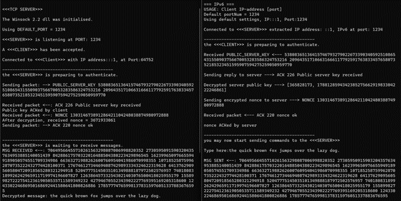

# Assignment 2 - 159342 (Secure Server)

A secure TCP client-server application that implements a hybrid cryptographic algorithm known as RSA with Cipher Block Chaining. Any messages sent from the client to the server are encrypted first, while they are decrypted at the server-side. 

Created using:
- C++ sockets library for networking
- Boost C++ library for help with cryptography (e.g. random number generator, big numbers)
- C++/C as the programming language
- JetBrains CLion as the IDE for programming.

---

### Massey University Disclaimer

This is a submission for an assignment for the Massey University course 159.342 - Operating Systems and Networks. Under no circumstances is it to be copied and submitted anywhere as plagiarised work.

---

### Assignment Brief

In this assignment, your task is to implement a hybrid encryption algorithm called RSA with Cipher Block
Chaining for communicating TCP client-server applications. You are not allowed to use any third-party
libraries that implement network security protocols and algorithms (e.g. OpenSSL, GMP, etc.), or other
toolset with built-in cryptographic functions (e.g. Qt), etc. except for Boost https://www.boost.org/. You
need to implement the RSA and CBC algorithms in C/C++ from scratch. The client/server must be able to show the original, 
encrypted and decrypted messages, as seen in the example below:
- The client types: hello
- The server prints locally: The received encrypted message was: 10898 15630 8308 321 13772 22674 22040
- After decryption, the message found is: hello

---

### Screenshots

